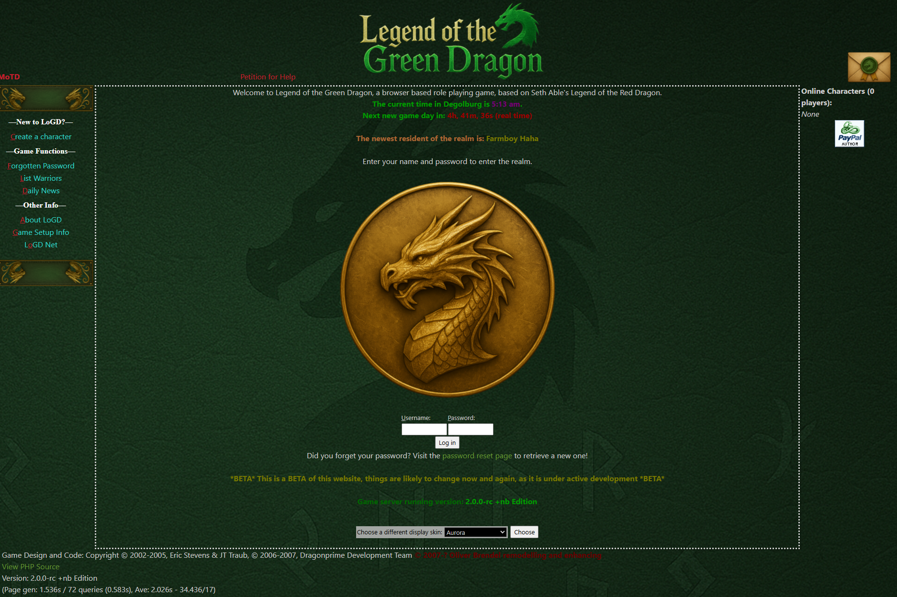

# Legend of the Green Dragon Fork


[](https://github.com/NB-Core/lotgd/actions/workflows/ci.yml)
This is a fork of the original Legend of the Green Dragon game by Eric "MightyE" Stevens (http://www.mightye.org) and JT "Kendaer" Traub (http://www.dragoncat.net)

The original readme and license texts follow below, also the installation + upgrade routines which haven't changed much.

**Note:** The `CHANGELOG.txt` file does not cover every change. Around 300 commits were made without entries, so refer to the git history for a complete list.

This fork updates the Dragonprime 1.1.1 release with modern tooling while remaining compatible with existing modules. It aims to provide a smoother experience on current PHP versions.  The source lives on [GitHub](https://github.com/NB-Core/lotgd) where you can follow development and open issues.

Features of this fork include:
- additional hooks
- a stat system with strength, dexterity, and other attributes
- numerous other changes documented in `CHANGELOG.txt`
- compatibility with PHP 8.3
- PHPMailer replacing the sendmail system
- mail notifications that auto-refresh via Ajax (resources under `async/`)
- incremental chat updates via `commentary_refresh` to load new messages without reloading the page
- Ajax requests are rate limited to roughly one per second; faster requests
  receive an HTTP 429 response. When enabling Ajax features, copy
  `config/async.settings.php.dist` to `config/async.settings.php` and adjust
  `$ajax_rate_limit_seconds` as needed.
- Composer integration for third-party modules
  - after modifying Composer settings, run `composer dump-autoload` to recognize new namespaces
  - after running `composer install` or `composer dump-autoload`, include `autoload.php` to load all dependencies
  - `autoload.php` automatically loads `vendor/autoload.php` and registers the project namespace
- mysqli is now the default database layer
- Twig is now the default template system located in `templates_twig/` (classic `.htm` files continue to work)

It should run on any modern PHP environment. Open an issue on [GitHub](https://github.com/NB-Core/lotgd/issues) with questions.

## Join the Community

Chat with other adventurers and get quick support on our Discord server!

[](https://discord.gg/dWEDQMaTcn)

## Demo


There is no official demo server. You can explore the original at [LotGD.net](https://lotgd.net) or the current version at [Shinobi Legends](https://shinobilegends.com). You can create an account to explore, but you will only have standard user rights.

## Contributing

See [AGENTS.md](AGENTS.md) for full contributor guidelines. Highlights:

- Follow the PSR-12 coding standard.
- Run `composer test` and `composer static` before committing.
- Check PHP syntax with `php -l` on changed PHP files.

## Table of Contents
- [Join the Community](#join-the-community)
- [Contributing](#contributing)
- [Read Me First](#read-me-first)
- [System Requirements](#system-requirements)
- [Quick Install](#quick-install)
- [Getting Started](#getting-started)
- [Install from Release Archive](#install-from-release-archive)
- [Cron Job Setup](#cron-job-setup)
- [SMTP Mail Setup](#smtp-mail-setup)
- [Beta Setup](#beta-setup)
- [After Upgrading](#after-upgrading)
- [Upgrading](#upgrading)
- [Installation](#installation)
- [Post Installation](#post-installation)
- [Composer Local Setup](#composer-local-setup)

## Read Me First

Thank you for downloading the modified version of Legend Of the Green Dragon.
See `CHANGELOG.txt` for a list of changes up until version 1.3.2.
👉 See [CHANGELOG.md](CHANGELOG.md) for a detailed history after that up until now.

If you need **modules**, [go there](https://github.com/NB-Core/modules) and fetch the ones you like.
There may be more out there, in the original dragonprime resources or other people's work.

If you need more legacy **templates** / skins for the game, [go there](https://github.com/NB-Core/lotgd-templates).

## System Requirements

To run Legend of the Green Dragon on a typical web host you will need:

- **Web server:** Apache 2 (or another server capable of running PHP)
- **PHP:** version 8.3 or newer
- **Database:** MySQL 5.0 or later. MariaDB is a compatible alternative.
- The database user must have the `LOCK TABLES` privilege.

## Getting Started
1. Clone the repository.
2. Run `composer install`.
3. Open `installer.php` in your browser and follow the prompts. When asked for a cache directory, set `DB_DATACACHEPATH` to a writable path such as `data/cache`.
4. (Optional) Use Docker—see [docs/Docker.md](docs/Docker.md).

## Maintenance

Regular upkeep tasks:

- Run `composer update` to update dependencies.
- Run `composer test` to execute the unit tests and `composer static` to run PHPStan or other static analyzers; ensure both pass before committing.
- Schedule `cron.php` via cron for automated jobs.
- Configure SMTP settings in `config/configuration.php`.
- If you change `DB_PREFIX`, clear the cache directory to avoid reusing metadata from the previous prefix.

## What’s new in 2.0
- Full PSR-4 / Composer refactor
- Doctrine ORM + migrations
- Twig template engine
- Async/Ajax (Jaxon) UX improvements
- PHP 8.3 baseline
 
Performance defaults:
- zlib output compression enabled when available.
- Data cache and Twig cache use the `datacachepath` directory; the game warns admins if the path is missing or not writable.
 
👉 See [UPGRADING.md](UPGRADING.md) if you’re moving from 1.3.x

## Further Reading

For details on key components:

- [docs/Nav.md](docs/Nav.md)
- [docs/Doctrine.md](docs/Doctrine.md)
- [docs/TranslationsGuide.md](docs/TranslationsGuide.md)
 - [UPGRADING.md](UPGRADING.md) — 1.3.x → 2.0 changes, performance defaults
 - [docs/Deprecations.md](docs/Deprecations.md) — deprecations and migration timelines

## Twig Templates

Twig templates reside in the `templates_twig/` directory. Each template should
have its own folder containing a `config.json`, `page.twig`, and `popup.twig`.
The distribution includes the **aurora** template and uses it as the default
skin. You can switch to another template by changing the `defaultskin` setting
or by setting a `template` cookie. If a matching folder is found, pages are
rendered with Twig; classic `.htm` templates continue to work as before.
Twig views receive variables for common placeholders like `nav`, `stats`, and
`paypal`, allowing flexible layouts.
Compiled Twig templates are cached under the directory defined by the
`datacachepath` setting. The engine attempts to create a `twig` subdirectory
and only enables caching when it is writable. If the path cannot be created
or written to, templates are rendered without caching.

`dbconnect.php` is created by the installer and stores database and cache
settings in plain PHP. It is the only core file not overwritten during updates
and remains the primary place for these settings. Site-specific overrides can
be placed in the `config/` directory (e.g., `config/configuration.php`) to keep
them separate from the core. After installation you can edit `dbconnect.php` to
point the `datacachepath` setting at a writable directory:

```php
$DB_USEDATACACHE  = 1;
$DB_DATACACHEPATH = "/path/to/lotgd/data/cache"; // without trailing slash
```

Common locations include a `data/cache` folder within the project or a
dedicated directory such as `/tmp/lotgd`. Give the web server write access
with a command like `chmod 775 data/cache` (or adjust as required by your
hosting environment). A valid `datacachepath` enables Twig caching—without it
pages must be recompiled and the game runs noticeably slower.

## Install from Release Archive

Official releases include the `vendor/` directory so no additional commands are
required. Download `lotgd-<version>.tar.gz` or `lotgd-<version>.zip` from the
[Releases](https://github.com/NB-Core/lotgd/releases) page, upload the contents
to your web server and open `installer.php` in your browser. The installer
will guide you through the setup.

## Release Workflow

Releases are created automatically when pushing a tag that starts with `v`.
Update the version in `common.php`, commit the change and push a tag like
`v2.0.0` or `v2.0.0-rc1`. GitHub Actions then builds archives that contain the
application and its `vendor/` dependencies while omitting development files such
as the `tests/` directory.

## Cron Job Setup

`cron.php` handles automated tasks such as daily resets. Run it from the command line with `php cron.php` and schedule it in your system's crontab. The script automatically determines its installation directory, so no manual configuration or `$GAME_DIR` value is required.

Enable the `newdaycron` flag in the admin settings (or set `newdaycron` to `1` in the `settings` table) to process new days exclusively through the cron job instead of when the first player logs in.

## SMTP Mail Setup

LOTGD uses **PHPMailer** for all outgoing mail. Open the admin settings (or edit
`config/configuration.php`) and fill in the options under **SMTP Mail Settings**:

```php
"gamemailhost"       => "SMTP Hostname",
"gamailsmtpauth"    => "SMTP Auth, bool",
"gamemailusername"   => "SMTP Username",
"gamemailpassword"   => "SMTP Password",
"gamemailsmtpsecure" => "SMTP Secure mechanism, enum: [starttls, STARTTLS, tls, TLS]",
"gamemailsmtpport"   => "SMTP port to use,int",
```

Enable `notify_on_warn` or `notify_on_error` and set `notify_address` in the
**Error Notification** section to receive site warnings or errors via email.
These notifications rely on the data cache, so ensure `$DB_USEDATACACHE` is set
to `1` and `$DB_DATACACHEPATH` points to a writable directory in
`dbconnect.php`.

## Beta Setup

`pavilion.php` is an optional script used when beta features are enabled per
player. Players flagged for beta access see a link to the pavilion in the
village and can use it to try experimental features. The repository provides a
minimal template for this file which simply displays a message and a commentary
section. Customize it to implement your own beta content.

## After Upgrading

After upgrading from versions prior to **1.1.1 DP Edition** you should:

- Check your races and remove any `charstats` hooks that only output the race under Vital Info.
- Users with data cache enabled must edit `dbconnect.php` and add:

```php
$DB_USEDATACACHE = 1;
$DB_DATACACHEPATH = "/your/caching/dir"; // without trailing slash
```

- Translators should replace hard coded names in dialogues with `%s` using the Translation Wizard.
- Verify that the server supported languages are configured correctly.
- Index definitions that exceed MySQL's key length limits are now automatically
  truncated by the installer. String columns in composite indexes are reduced to
  safe prefixes (for example `(191)` for `utf8mb4`) when necessary.

----------------------------------------------------------------------

# Legend of the Green Dragon
by  Eric "MightyE" Stevens (http://www.mightye.org)
and JT "Kendaer" Traub (http://www.dragoncat.net)

Modification AND Support Community Page:
http://dragonprime.net

Primary game servers:
http://lotgd.net
http://logd.dragoncat.net

For a new installation, see INSTALLATION below.
For upgrading a new installation, see UPGRADING below.
If you have problems, please visit Dragonprime at the address above.


## UPGRADING

Legacy installation and upgrade instructions have moved to
[docs/LegacyREADME.md](docs/LegacyREADME.md).

When upgrading from a legacy release, run the legacy upgrade script before
migrations. This applies all legacy SQL for newer versions prior to running
Doctrine migrations.

1. **Step 1** (pre-migration versions only):

   ```bash
   php bin/legacy-upgrade --from-version="1.1.1 Dragonprime Edition"
   ```

2. **Step 2**:

    ```bash
    php bin/doctrine migrations:migrate
    ```

    The command reads `src/Lotgd/Config/migrations.php` and
    `src/Lotgd/Config/migrations-db.php` by default. If your configuration lives
    elsewhere, pass `--configuration` and `--db-configuration` with the
    appropriate paths.

Omitting `--from-version` bypasses legacy SQL entirely.
- [Installation](#installation)
  - [Step 1: Clone the Repository](#step-1-clone-the-repository)
  - [Step 2: Set Up the Docker Environment](#step-2-set-up-the-docker-environment)
  - [Step 3: Build and Start the Containers](#step-3-build-and-start-the-containers)
- [Configuration Files](#configuration-files)
  - [Dockerfile](#dockerfile)
  - [docker-compose.yml](#docker-composeyml)
  - [.env File](#env-file)
  - [.htaccess](#htaccess)
- [Notes](#notes)
  - [Port Configuration](#port-configuration)
  - [SSL/TLS](#ssltls)
  - [Persistent Volumes](#persistent-volumes)
  - [Security](#security)
- [Useful Commands](#useful-commands)
- [Troubleshooting](#troubleshooting)
- [License](#license)

---

## Prerequisites

- **Docker** installed
- **Docker Compose** installed
- Basic knowledge of Docker and command-line operations

---

## Installation

### Step 1: Clone the Repository

Clone the LOTGD repository to your local machine:

```bash
git clone https://github.com/NB-Core/lotgd.git
cd lotgd
```

### Step 2: Set Up the Docker Environment

This repository already includes the essential Docker and configuration files. Review these files and adjust them as needed:

1. **Dockerfile**
2. **docker-compose.yml**
3. **.env** – copy `\.env.example` to `.env` and update values as needed
4. **.htaccess**

The details of each file are covered in the [Configuration Files](#configuration-files) section.

### Step 3: Build and Start the Containers

Build the Docker containers and start the environment:

```bash
docker-compose up -d --build
```

### Step 4: Run the Installer

With the containers running, open `installer.php` in your browser. When prompted for a cache directory, set `DB_DATACACHEPATH` to a writable location (for example `data/cache`) to enable caching.

---

## Configuration Files

### Dockerfile

```Dockerfile
# Composer stage – install dependencies
FROM composer:2 AS composer
WORKDIR /app
COPY composer.json composer.lock ./
RUN composer install --no-dev --no-interaction --prefer-dist

# Final image with PHP and Apache
FROM php:apache

# Install required packages and PHP extensions
RUN apt-get update && apt-get install -y \
    libpng-dev \
    libjpeg-dev \
    libonig-dev \
    libzip-dev \
    && docker-php-ext-configure gd --with-jpeg \
    && docker-php-ext-install gd mysqli pdo pdo_mysql mbstring zip \
    && rm -rf /var/lib/apt/lists/*

# Enable mod_rewrite and .htaccess overrides
RUN a2enmod rewrite
RUN sed -i '/<Directory \/var\/www\/>/,/<\/Directory>/ s/AllowOverride None/AllowOverride All/' /etc/apache2/apache2.conf

# Copy application code and vendor directory
WORKDIR /var/www/html
COPY . /var/www/html
COPY --from=composer /app/vendor /var/www/html/vendor

# Set permissions for web server
RUN chown -R www-data:www-data /var/www/html

# Expose Apache port
EXPOSE 80

# Enable verbose PHP error reporting
RUN echo "display_errors = On;" >> /usr/local/etc/php/conf.d/docker-php.ini \
    && echo "display_startup_errors = On;" >> /usr/local/etc/php/conf.d/docker-php.ini \
    && echo "error_reporting = E_ALL;" >> /usr/local/etc/php/conf.d/docker-php.ini \
    && echo "log_errors = On;" >> /usr/local/etc/php/conf.d/docker-php.ini \
    && echo "error_log = /dev/stderr;" >> /usr/local/etc/php/conf.d/docker-php.ini

CMD ["apache2-foreground"]
```
